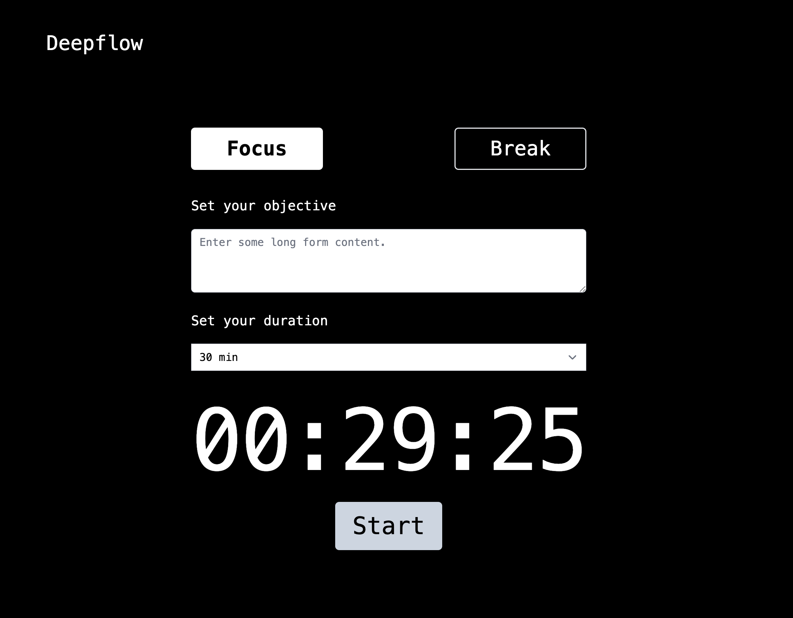

# DeepFlow App (WIP)

Minimalist focus app that uses an adaptation of [Pomodoro technique](https://en.wikipedia.org/wiki/Pomodoro_Technique).

It's not just another pomodoro app :)

What I don't like about the existing Pomodoro apps and technique ?

- **Disruption of Flow** : Some people prefer to work for longer uninterrupted time slices, others prefer to start with 15min. Enforcing the 25min rule as a minimum followed by breaks of 5min can hinder concentration and creativity.
- **Focus is flexible**: I want a system that help me enter the flow state by adapting the duration to my level of energy and motivation. As an example, I start my day by short durations, and based on my time slice rating, energy and motivation I adapt the duration.
- **Reflect and measure my flow**: I want to give input on how i was focused (time slice rating), based on that i can adjust the upcoming time slices.

> I also built this to learn EDA protocols by making something useful, you might find different API implementations

## Features

- [ ] Progressive pomodoro
- [ ] Time slice rating
- [ ] Short/Long breaks
- [ ] Event API
- [ ] Slack integration
- [ ] Widgets
- [ ] Deep flow analytics





### Develop

To develop all apps and packages, run the following command:

```
turbo run dev
```
